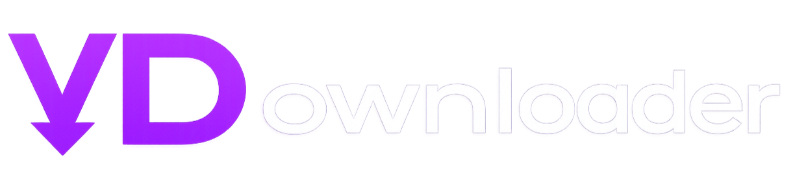
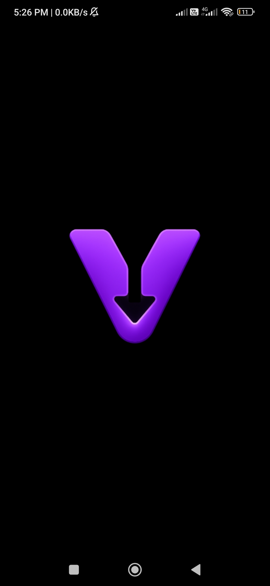
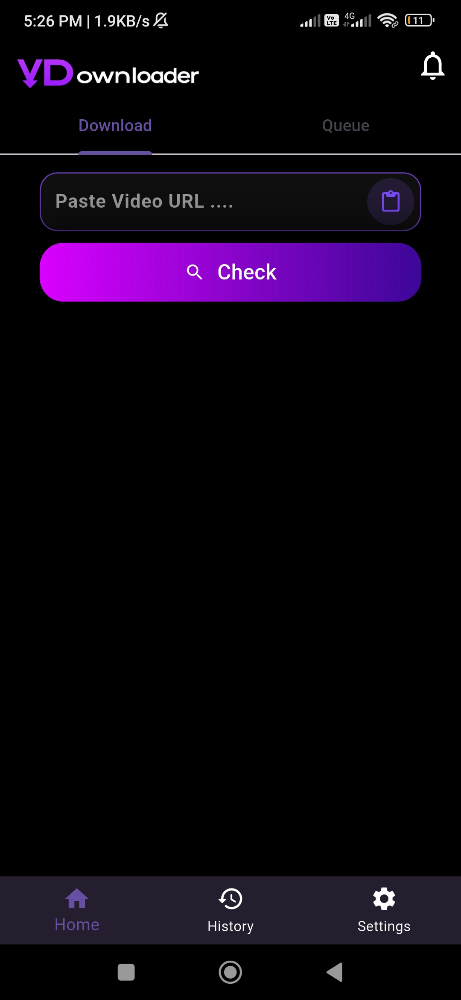
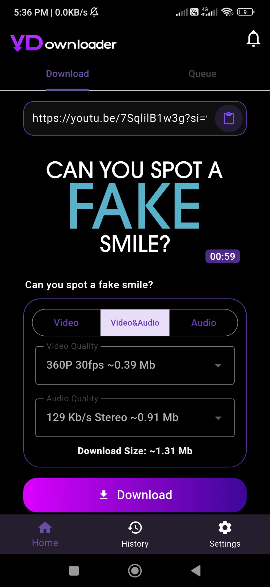
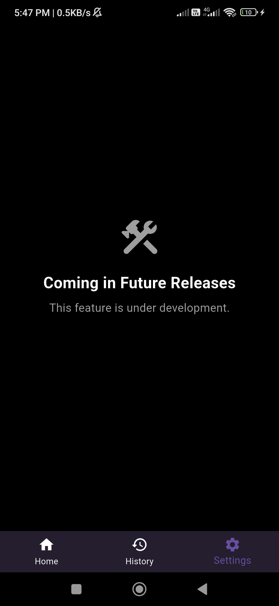

# A modern, open-source cross-platform GUI for yt-dlp built with Flutter and Python.
## Screenshots

  
  &nbsp;&nbsp;&nbsp;
  
  &nbsp;&nbsp;&nbsp;
  
  &nbsp;&nbsp;&nbsp;
  

## What is VDownloader?
### VDownloader is a cross platform yt-dlp wrapper app built with flutter and python.
## Why VDownloader?
### One of the things to pushed me to work on this project was noticing that many yt-dlp warpers were missing something important : standradization, I wanted to build a GUI that both beginners and advanced users could benefit from.
## Features (till pre V0.2)

  <h3>
    <li>Downloading videos from YouTube</li>
    <li>Downloading audio without video and vice versa</li>
    <li>Quailty format selector which backend downloads best codec to the same quality to save size</li>
    <li>Downloading video thumbnails and subtitle files (Embedding is not available in pre-v0.2 because the required dependencies are not yet included.)</li>
  </h3>

## Tech Stack
### UI => Dart(Flutter)
### Backend => Python
## Challenges
### Building VDownloader came with several technical challenges.

The first challenge was running the upstream `yt-dlp` directly on Android. Most Android yt-dlp wrappers rely on `youtubedl-android`, which is a convenient Java library but often lags behind the latest upstream releases. I wanted VDownloader to always use the official `yt-dlp`, so I integrated a Python backend into the Flutter application using Chaquopy.

The second challenge was bundling prebuilt native binaries such as FFmpeg. My initial approach was to copy the binaries from the application's assets and execute them at runtime. However, Android 10+ enforces the Write XOR Execute (W^X) security policy, which prevents applications from executing files copied into writable storage.

To solve this, I packaged the FFmpeg binaries as native libraries by renaming them with the `.so` extension. This allowed Android to package them correctly and load them from the application's native library directory at runtime.
## Building
### 1- Download Dependencies

<h4>
  <li>Android SDK</li>
  <li>Flutter SDK</li>
  <li>Python 3</li>
</h4>

### 2- Clone the repo
### 3- Run `flutter build apk --release` from the project root.
## Limitaions
### The UI still doesn't expose all yt-dlp features, but I plan to improve this in future releases!
### Thumbnail and subtitle embedding is currently not working.
### The download process currently fails if an invalid URL is entered. Restarting the app is required.
## Future Plans
### I want to build a UI that exposes nearly all yt-dlp features (including its helper tools) without overwhelming beginner users.
### I also plan to integrate a custom download engine into the app. When that happens, I plan to fork the project under the name LibreLoad.
### I also plan to add post-processing features that can blur mature content and remove background music from downloaded audio.
## AI Usage
### The following list contains the parts of the project that were primarily generated with the help of AI:
<h4>
  <li>MainActivity.kt</li>
  <li>Some advanced backend functions (for example, the format sorting function)</li>
  <li>Drop down logic in the UI</li>
</h4>

### The remaining code was either written entirely by me or developed under my supervision with the assistance of AI. I was also learning both Dart and Flutter while building this project.
## Special thanks
### Thanks to all who made yt-dlp and ffmpeg 
